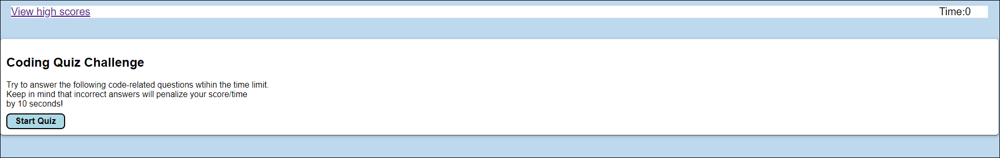
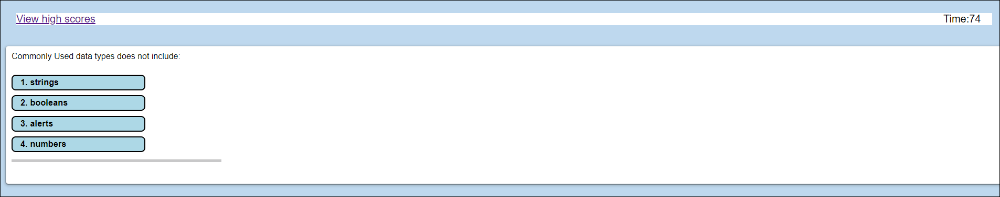
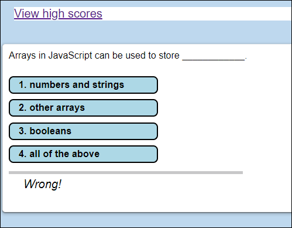
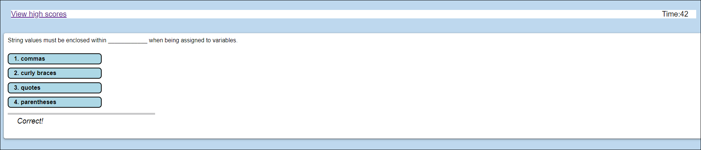
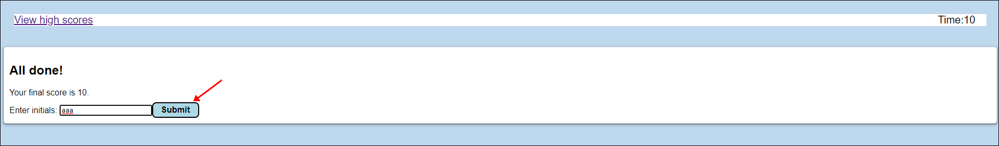
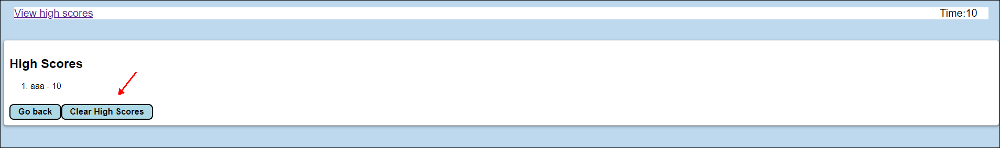
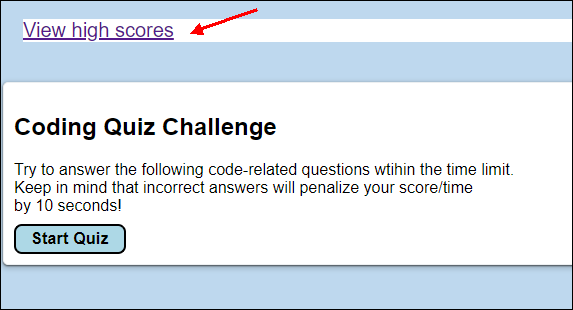
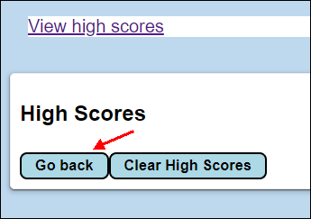
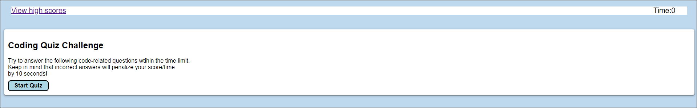

# JavaScript Coding Quiz using Web APIs


## Description

```md
This website was created to test your JavaScript coding skills with a timed multiple choice test.

User Story:
AS A coding boot camp student
I WANT to take a timed quiz on JavaScript fundamentals that stores high scores
SO THAT I can gauge my progress compared to my peers

Acceptance Criteria:
GIVEN I am taking a code quiz
WHEN I click the start button
THEN a timer starts and I am presented with a question
WHEN I answer a question
THEN I am presented with another question
WHEN I answer a question incorrectly
THEN time is subtracted from the clock
WHEN all questions are answered or the timer reaches 0
THEN the game is over
WHEN the game is over
THEN I can save my initials and score
```

## Table of Contents

- [Description](#description)
- [Installation](#installation)
- [Usage](#usage)
- [Credits](#credits)
- [License](#license)
- [Features](#features)
- [How-to-Contribute](#how-to-contribute)
- [Tests](#test-instructions)
- [Questions](#questions)

## Installation

No installation is needed to use this application. 

## Usage

Click on the link below to use this application:<br>
https://abrownstein2022.github.io/web-api-javascript-coding-quiz/

```md
This quiz displays 5 multiple choice questions on JavaScript with 4 possible choices.

You get 15 seconds for each question or 75 seconds total.

If you select the wrong answer, you will penalized by 10 seconds.

Once the timer counts down to 0, the quiz is over.

Please refer to the screenshots and animation below to see how the application works.
       
```


 


 



 

## Credits
Alexis Brownstein, bootcamp instructor, TAs and Tutor 

## License

 ```md
 MIT 
```


## Features
```md
The main features in this project are:
1. Start quiz button with timer at top right
2. Five questions to test your JavaScript knowledge
3. Time counts down and you also lose an additional 10 seconds for each wrong answer
4. Submit (save) high scores button
5. View high scores ink to display currently saved high scores with users' initials
6. Clear high scores button
7. Go back (to start) button  
8. Game is over when you answer all the questions or if the timer reaches 0 before you answer all the questions.
```
## How-to-Contribute

N/A
## Test Instructions

```md
N/A
```
## Questions

```md
Feel free to contact me with any questions.

My email is: alexis@drdatabase.com.
```

My GitHub Profile link:
  
  https://github.com/abrownstein2022
 
